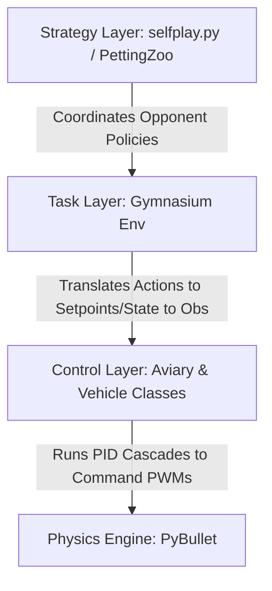

# How We Teach Drones in cyberFly

Autonomous drones are everywhere: delivering packages, mapping disaster zones, inspecting power lines, and playing tag at 140 km/h in racing leagues. Behind every one of those feats is a control system and, increasingly, a learned policy trained exactly like what you're about to build.

This guide walks you through everything you need to go from zero to flying autonomous drones in simulation — no prior robotics or machine-learning experience required, just working Python knowledge.

By the end of this tutorial you will have:

- Launched a simulated drone and watched it hover under its own control.
- Logged and plotted a live flight trajectory.
- Written your own hand-crafted flight controller in plain Python.
- Trained a neural network policy to fly using reinforcement learning.
- Set up competitive multi-agent training where two drones learn to outmaneuver each other.

**Why simulate first?** Real drone crashes are expensive, loud, and occasionally on fire. A physics simulator lets you run thousands of flight hours overnight on a laptop, crash as many times as you need, and transfer the lessons to hardware only once the policy is already working. Everything in this repo runs in PyBullet — a real-time rigid-body physics engine — making the gap between simulation and hardware as small as possible.

Don't worry if some of those sound intimidating right now — each exercise builds on the last, and every step is fully explained.

---

## 1. Classroom Course Roadmap & Suggested Schedules

Depending on the length of your training program, choose one of the syllabus schedules below:

| Syllabus Plan | Focus Area | Exercises to Cover | Estimated Time |
| :--- | :--- | :--- | :--- |
| **Crash Course / Fast Walkthrough** | Basic physics, manual control, and evaluating pre-trained models. | Exercises 1, 2, and 7 | 45 minutes |
| **Full Lab / Hands-on Workshop** | Custom control design and single-agent reinforcement learning. | Exercises 1, 2, 3, 4, 5, and 7 | 2 hours |
| **Advanced Seminar** | Multi-agent setups, competitive/adversarial self-play, and FSP. | Exercises 5, 6, and 7 | 3 hours + |

---

## 2. Prerequisites & Safe Takeoff Checks

Before writing your first flight loop, ensure your workspace is ready for takeoff:

1. **System & Graphics Dependencies**: The simulator opens a 3D window to show the drone. This requires a display (monitor or virtual display). If you are on a remote server or Docker container without a screen, add `render_mode=None` to skip the window and run headless.
2. **Import Verifications**: Confirm your Python environment can find the package:
   ```bash
   python -c "import cyberFly; print(cyberFly.__file__)"
   ```
   You should see a file path printed. If you get `ModuleNotFoundError`, run `pip install -e .` from the repo root first.
3. **Verify Interactive Matplotlib Setup**: Some exercises plot graphs. Check that Matplotlib can open windows:
   ```bash
   python -c "import matplotlib.pyplot as plt; print(plt.get_backend())"
   ```
   Any backend name printed (e.g., `TkAgg`, `Qt5Agg`) means you're good. If you're on a headless server, use `matplotlib.use('Agg')` at the top of scripts to save plots to disk instead.

> **Quick smoke test**: Run `python examples/core/01_single_drone.py` — if a 3D window opens showing a hovering drone, your entire setup is working correctly.

---

## 3. How a Quadcopter Actually Flies

Before writing a single line of control code, understanding the raw physics will save you hours of debugging.

A quadcopter has **four rotors** arranged symmetrically on arms. Two spin clockwise (CW) and two spin counter-clockwise (CCW), alternating around the frame:

```
     CCW(1)      CW(2)
          \      /
           [Body]
          /      \
      CW(3)      CCW(4)
```

Here is what happens to the airframe when you change motor speeds:

| Desired Motion | What You Change | Why It Works |
| :--- | :--- | :--- |
| **Hover / Climb / Descend** | Increase or decrease all 4 equally | Net upward thrust balances gravity. More thrust = climb. |
| **Roll left/right** | Increase motors on one side, decrease the other | Differential thrust tilts the frame; tilt creates a horizontal force component. |
| **Pitch forward/backward** | Increase front or rear pair | Same as roll, but front-to-back. |
| **Yaw (spin in place)** | Increase CW pair, decrease CCW pair (or vice versa) | CW rotors produce CCW reaction torque. Unbalancing the pairs creates net yaw without tilting the body. |

> **Key insight**: At the lowest level (Mode -1), you command four motor voltages directly. Every higher flight mode is just a chain of PID controllers automatically computing the right four voltages from your higher-level command. The cascade is:
> $$[x,y,z] \xrightarrow{\text{pos PID}} [v_x,v_y,v_z] \xrightarrow{\text{vel PID}} [\phi,\theta,\psi] \xrightarrow{\text{att PID}} [\omega_1,\omega_2,\omega_3,\omega_4]$$

> **Common Misconception**: "Can't I just command thrust directly?" — You can (Mode -1), but then *you* must compute roll, pitch, and yaw corrections at ~120 Hz. That's exactly what the PID cascade does for you. Start at Mode 7 and only go lower if you have a specific reason.

---

## 4. Core Theory: The Drone Teaching Stack

To teach a drone effectively, you must understand the interaction of three distinct layers in this codebase:



### Layer 1: The Control Layer (Aviary & Component Abstractions)
At the lowest level, `cyberFly.core.Aviary` manages the physics world (via PyBullet), spawning drones, updating sensor buffers, and executing sub-step loops. 
* **The Controller Cascade**: Drones do not automatically follow linear commands like "go forward 1 meter." To achieve that position shift, a hierarchical stack of PID loops (Proportional-Integral-Derivative) must fire at high frequency:
  $$\text{Target Position} \xrightarrow{\text{Outer PID}} \text{Target velocity} \xrightarrow{\text{Middle PID}} \text{Target Attitude/Rates} \xrightarrow{\text{Inner PID}} \text{Raw PWM Motor Voltages}$$

  > **Analogy**: Think of this like GPS navigation. The outer loop is the GPS saying "turn left in 200m." The middle loop is your brain deciding how fast to steer. The inner loop is your hands physically turning the wheel. You never manually say "rotate the steering column 37 degrees" — the lower layers handle that automatically.

* **Flight Modes**: For beginners, we restrict coordinates using explicit flight modes. In cyberFly, you can set control modes using `env.set_mode(mode_id)`. Here is the full breakdown of how action values are translated under the hood for a QuadX multicopter:

| Flight Mode ID | Action Coordinate Definitions | Core PID Loop Engaged | Target Use Case & Experience |
| :--- | :--- | :--- | :--- |
| **-1** | $[m_1, m_2, m_3, m_4]$ | None (Direct Voltage Control) | System identification, custom firmware, advanced control |
| **0** | $[\omega_p, \omega_q, \omega_r, T_{thrust}]$ | Angular Velocity PID | Acrobatic (Rate/Acro) piloting |
| **1** | $[p, q, r, v_z]$ | Angular Position & Velocity PID | Stabilized flight with direct alt-rate control |
| **2** | $[\omega_p, \omega_q, \omega_r, z_{alt}]$ | Angular Velocity & Altitude PID | Rate-level control with altitude hold |
| **3** | $[p, q, r, z_{alt}]$ | Angular Position & Altitude PID | Angle-level attitude control with altitude hold |
| **4** | $[v_{body,u}, v_{body,v}, \omega_r, z_{alt}]$ | Local translation & Altitude PID | Local coordinate guidance (FPV style velocity) |
| **5** | $[v_{body,u}, v_{body,v}, \omega_r, v_z]$ | Local translation & Alt-rate PID | Local speed-based control without altitude constraint |
| **6** | $[v_{world,x}, v_{world,y}, \omega_r, v_z]$ | World translation & Alt-rate PID | Global velocity vectors (e.g. "go north at 2m/s") |
| **7** | $[x_{world}, y_{world}, \psi_{yaw}, z_{world}]$| Full Position & Yaw Control | High-level waypoint navigation and beginners |

> **Start here if you're new**: Use **Mode 7** for all beginner exercises. You just tell it where to go — `[x, y, yaw, z]` — and the entire cascade above handles the rest automatically. Work your way down to lower mode numbers only once you're comfortable.

### Layer 2: The Task Layer (Gymnasium/Single-Agent RL)
The task layer bridges raw vehicle controls with reinforcement learning. Standard RL entities map directly to drone parts:
> **Analogy**: Think of the agent as a student pilot, the observation as the cockpit instruments they read, the action as the stick/throttle inputs they produce, and the reward as the flight instructor's score sheet after each maneuver.

* **The Agent (Policy)**: A neural network that translates an **Observation** vector into a continuous **Action** vector.
* **The Action**: In standard tasks, a policy outputs action coordinates matching the vehicle's active `flight_mode` (commonly Mode 0, Mode 6, or Mode 7).
* **The Observation**: A concatenated array of numbers representing current attitudes (roll, pitch, yaw), linear velocities, angular velocities, relative waypoint distances, and target coordinate vectors. Think of it as the drone's "senses."
* **The Reward**: A single number fed back after each simulation step telling the policy how well it is doing. Good reward design is one of the hardest parts of RL — the reward signal must be informative but not so dense that it accidentally teaches the wrong behavior. Reward design is highly sensitive to the vehicle's physical limit. It often balances three components:
  1. *Tracking Reward*: Encourages proximity to target state (e.g., negative distance error).
  2. *Control Effort Penalty*: Discourages violent, high-frequency command oscillations (e.g., penalizing high derivative changes).
  3. *Survival/Boundary Bonus*: Encourages avoiding crashes and staying inside the designated airspace.

### Layer 3: The Strategy Layer (PettingZoo & Self-Play)
In multi-agent systems (like dogfighting, combat waypoint pursuit, or swarm forage), standard single-agent loops fail because the state space changes as other agents learn. The strategy layer builds adversarial boundaries:
* **Double Oracle / Fictitious Play**: Instead of learning a static strategy, agents train against a probability distribution of historical versions of their competitors.
* **Self-Play Wrappers**: Wraps multi-agent PettingZoo rules so they look like a single-agent Gymnasium task to the training optimizer, silently running competitor models in the background.

---

## 4. Deep-Dive Practical Exercises

Each exercise uses existing project code. Run commands from the repository root.

## Exercise 1: Simulator Sanity Check & Physics Baseline

**Objective**: Verify your local Bullet engine backend and analyze basic gravity integration and motor idle characteristics.

> **What you'll learn**: How to launch the simulator and confirm that the physics engine and graphics backend are working correctly on your machine. Think of this as the "Hello World" of drone simulation.

### Step-by-Step Instructions
1. Navigate to the repository root directory.
2. Open [examples/core/01_single_drone.py](examples/core/01_single_drone.py) to inspect the script structure.
3. Execute the script from your terminal:
   ```bash
   python examples/core/01_single_drone.py
   ```
4. Observe the spawned PyBullet window. A single quadcopter should spawn at $z=1$ and instantly begin tracking to hold its altitude.

### Under-the-Hood Code Analysis
* **Start State definition**: 
  ```python
  start_pos = np.array([[0.0, 0.0, 1.0]])  # x=0 East, y=0 North, z=1 Up (metres)
  start_orn = np.array([[0.0, 0.0, 0.0]])  # roll=0, pitch=0, yaw=0 (radians)
  ```
  These define an ENU (East-North-Up) 3-column coordinate matrix. Each row is one drone. The double brackets `[[...]]` are intentional — the Aviary expects a 2-D array so it can handle multiple drones with the same call signature.
* **Instantiating the Aviary**:
  ```python
  env = Aviary(start_pos=start_pos, start_orn=start_orn, render=True, drone_type="quadx")
  ```
  `render=True` opens the PyBullet GUI window. You'll see the drone body, four rotor discs, and a ground plane. The world axes (red=X East, green=Y North, blue=Z Up) appear in the corner.
* **Setting Control Mode**:
  ```python
  env.set_mode(7)
  ```
  Mode 7 activates full position+yaw PID. The drone immediately tries to hold $(0, 0, 1)$ against gravity. Without this call the motors produce zero thrust and the drone falls through the floor.
* **The Simulation Loop**:
  ```python
  for _ in range(1000):
      env.step()
  ```
  Each `env.step()` advances the physics clock by $1/120$ seconds (approximately 8.3 ms). 1,000 steps = ~8.3 seconds of simulated time.

> **What to look for in the window**: The drone should stay nearly stationary at $(0, 0, 1)$. Tiny oscillations (a few millimetres) are normal — that is the PID continuously overcorrecting and recovering. If the drone drifts away or crashes, something is wrong with your installation.

### Success Criteria & Verification
- [ ] A 3D simulation window successfully launches and renders the scene.
- [ ] The drone locks its coordinate frame position and hovers near its initial z-axis altitude with minor sub-centimeter oscillations.
- [ ] The terminal command exits cleanly after exactly 1,000 steps (approximately 8 seconds of simulated time) without errors.

### Lab Stretch Challenges & How to Solve Them
* **Challenge**: Modify [examples/core/01_single_drone.py](examples/core/01_single_drone.py) to spawn the drone higher at $z=3$ with a roll orientation of $45^\circ$ ($\frac{\pi}{4}$ radians) to observe recovery behavior.
* **How to Solve**: Change the variables to:
  ```python
  start_pos = np.array([[0.0, 0.0, 3.0]])
  start_orn = np.array([[np.pi / 4, 0.0, 0.0]])
  ```
  Watch the rendering loop. Note how the inner-loop PID controllers immediately command the motors to recover level flight ($\text{roll}=0$) while stabilizing at altitude $z=3$. The recovery should complete in under 1 second — if it takes much longer, the drone is on the edge of instability.

> **Common Misconception**: "The drone is already at $z=1$, so gravity should make it fall without thrust." — Correct! `set_mode(7)` is what activates the controller. Remove that line and re-run to see the drone fall straight to the floor. This confirms the controller is doing real work.

---

## Exercise 2: Continuous Target-Tracking & Path Logging

**Objective**: Command a series of sequential position setpoints using a manual flight loop, record physical trajectory measurements, and generate performance plots showing rise times and error dynamics.

> **What you'll learn**: How to command the drone to fly between waypoints, log its position over time, and plot the trajectory as a graph. This gives you a feel for how quickly the drone responds and how accurately it tracks targets.

### Step-by-Step Instructions
1. Open and review [examples/core/03_control.py](examples/core/03_control.py).
2. Execute the script:
   ```bash
   python examples/core/03_control.py
   ```
3. Watch the drone fly from its start coordinates to Point A, then turn and climb up to Point B.
4. After 1,000 steps, a Matplotlib chart will open plotting $x$, $y$, and $z$ over time.

### Under-the-Hood Code Analysis
* **Logging State Variables**:
  The logging buffer is allocated up front:
  ```python
  log = np.zeros((1000, 3), dtype=np.float32)
  ```
  Inside the stepping loop, the state is logged using:
  ```python
  log[i] = env.state(0)[-1]
  ```
  `env.state(0)` returns the full state vector of drone `0`. The last element `[-1]` corresponds to the actual $(x, y, z)$ world coordinates in metres.

  > **What does `env.state(0)` contain?** The full state is a stacked array of `[linear_velocity, angular_velocity, ..., position]`. Slicing `[-1]` grabs the last row — the 3D position. This is a common cyberFly pattern you'll use in every exercise.

* **Target Step Changes**:
  ```python
  setpoint = np.array([1.0, 0.0, 0.0, 1.0])
  env.set_setpoint(0, setpoint)
  ```
  In flight mode 7, the setpoint is $[x, y, \psi_{yaw}, z]$ — note the yaw slot is index 2, **not** index 3. This catches beginners frequently: if the drone spins unexpectedly, check whether you passed yaw in the right position.

* **What "rise time" means**: When you command the drone from $x=0$ to $x=1$, it doesn't jump there instantly. It accelerates, possibly overshoots slightly, then settles. The time from command to within 5% of the target is the **rise time** — visible as the slope on the trajectory plot.

### Success Criteria & Verification
- [ ] The drone moves towards $x=1$ on the local horizontal plane for 500 steps.
- [ ] At step 500, the drone shifts direction, climbs up to $z=2$, and undergoes a $45^\circ$ heading rotation.
- [ ] A Matplotlib window displays a 2D line plot showing rise times of each position axis.

```
       Trajectory Plot Expected Output Format:
       Altitude (z)
       3.0 |               _______________
       2.0 |              /
       1.0 | ____________/
       0.0 |_____________________________
           0            500          1000  (Steps)
```

### Lab Stretch Challenges & How to Solve Them
* **Challenge**: Expand the flight plan in [examples/core/03_control.py](examples/core/03_control.py) to a 3-legged waypoint mission. Add a third segment for steps 1000-1500 targeting $(x=-1, y=2, \psi = -90^\circ, z=3)$.
* **How to Solve**:
  1. Increase the log allocation dimensions to `(1500, 3)`.
  2. Add an additional stepping block at the end of the script:
     ```python
     setpoint_3 = np.array([-1.0, 2.0, -np.pi / 2, 3.0])
     env.set_setpoint(0, setpoint_3)
     for i in range(1000, 1500):
         env.step()
         log[i] = env.state(0)[-1]
     ```
  3. Ensure the final `plt.plot(np.arange(1500), log)` reads the fully extended array size.

---

## Exercise 3: Sensor-Driven Camera Perceptions

**Objective**: Configure on-board virtual drone camera attachments and inspect output matrices (RGBA, depth, segmentation maps).

> **What you'll learn**: How to attach a virtual camera to a drone and read the image, depth, and segmentation data it produces. This is the foundation of any vision-based task (e.g., tracking a target by color).

### Step-by-Step Instructions
1. Examine [examples/core/04_camera.py](examples/core/04_camera.py). Note how camera options are defined within `drone_options`.
2. Run the script:
   ```bash
   python examples/core/04_camera.py
   ```
3. The simulator opens and executes a brief 100-step loop. After the loop completes, independent image visualization windows will render.

### Under-the-Hood Code Analysis
* **Configuring Camera Arrays**:
  ```python
  drone_options = dict(
      use_camera=True,
      camera_angle=30,       # degrees below horizontal (30 = looking slightly downward)
      camera_FOV_degrees=110, # wide-angle lens (human eye ≈ 120 deg)
      camera_fps=30,          # render one camera frame every ~4 physics steps
  )
  ```
  Setting `camera_fps=30` means the camera doesn't render every physics tick (120 Hz). It renders only when enough simulated time has passed for the next frame. This prevents the rendering pipeline from becoming the performance bottleneck.

* **Retrieving Active Sensor Buffers**:
  ```python
  RGBA_img = env.drones[0].rgbaImg   # shape: (H, W, 4) — Red, Green, Blue, Alpha channels
  DEPTH_img = env.drones[0].depthImg # shape: (H, W)    — linearised distance in metres
  SEG_img = env.drones[0].segImg     # shape: (H, W)    — integer object IDs per pixel
  ```
  Each frame is a NumPy array you can manipulate directly with OpenCV or any standard CV library.

* **Why each image type matters**:
  - **RGBA**: What a real camera sees. Used for color-based target detection.
  - **Depth**: Distance to every pixel — what a LiDAR or stereo camera gives you. Perfect for obstacle avoidance.
  - **Segmentation**: The simulation cheats and gives you perfect object labels. Great for training detection models because you get free ground-truth annotations.

### Success Criteria & Verification
- [ ] Red, green, blue color channels (RGBA) are outputted and rendered correctly.
- [ ] A depth frame represents distances to target surfaces (near pixels map to dark shades, far pixels to light shades).
- [ ] Object segmentation maps colors specifically matching discrete environmental boundary bodies.

### Lab Stretch Challenges & How to Solve Them
* **Challenge**: Create a dynamic camera stabilization rig. Shift the pitch orientation (`camera_angle`) dynamically throughout flight to track a moving center point.
* **How to Solve**:
  Look at `env.drones[0]`. You can modify the drone's internally stored configuration parameters, or dynamically update the orientation matrix during your main execution loop. In class environments, you can modify `camera_angle` on each simulator step before calling `env.step()`.

---

## Exercise 4: Hand-Crafted Custom Flight Controllers

**Objective**: Register, tune, and test a manual reactive controller class that maps linear coordinate displacements to velocity control inputs (Mode 6).

> **What you'll learn**: How to write a simple reactive flight controller in plain Python math — no neural networks involved. This is the conceptual bridge between hardcoded rules and learned policies, and it builds intuition you'll use in all RL exercises.

### Step-by-Step Instructions
1. Open and review [examples/core/05_custom_controller.py](examples/core/05_custom_controller.py).
2. Execute the script:
   ```bash
   python examples/core/05_custom_controller.py
   ```
3. Watch the drone execute constant angular spins while holding its position at $(1.0, 1.0, 1.0)$.

### Under-the-Hood Code Analysis
* **Subclassing `ControlClass`**:
  ```python
  class CustomController(ControlClass):
      def step(self, state: np.ndarray, setpoint: np.ndarray):
  ```
  The Aviary calls `controller.step(state, setpoint)` every physics tick. Your controller must return a valid action array whose length matches the active flight mode. The Aviary won't validate the values — if you return nonsense, the drone will behave nonsensically.

* **P-only control and why it oscillates**:
  ```python
  target_velocity = np.array([1.0, 1.0, 1.0]) - state[-1]  # error = target - actual
  ```
  A Proportional-only controller applies a command proportional to the current error. When the drone reaches the target, the error → 0 and the command → 0. But the drone is still *moving* — it overshoots, creating a new error in the opposite direction, which again generates a corrective command. This oscillation is the hallmark of pure P control.

* **P vs PD comparison** — here's what each looks like on the $z$ axis:

  ```
  P-only (oscillates):         PD (damped):
  z
  1.2 |  /\/\/\/\___           1.2 |  /\
  1.0 |                        1.0 |    \____
  0.8 |                        0.8 |
      |-->  time                    |-->  time
  ```

* **KP and KD intuition**:
  - **KP too high**: Violent overcorrections, the drone shakes rapidly.
  - **KP too low**: The drone crawls towards the target and may never fully arrive.
  - **KD too high**: The derivative term resists all motion — the drone feels "sticky" and barely moves.
  - **KD too low**: Oscillations aren't damped — the drone bounces around the target forever.
  - **Sweet spot**: Start with `KP = 1.0` and `KD ≈ 0.1 * KP`. Tune KP until response speed is acceptable, then raise KD until oscillations disappear.

### Success Criteria & Verification
- [ ] Custom controller registrations succeed inside the vehicle class.
- [ ] Mode 8 activates without raising parameter range exceptions.
- [ ] The drone takes off, centers over $(1, 1, 1)$, and spins symmetrically along the vertical axis at a constant rate of $0.5$ rad/s.

### Lab Stretch Challenges & How to Solve Them
* **Challenge**: Add a Proportional-Derivative (PD) constraint to the custom controller in [examples/core/05_custom_controller.py](examples/core/05_custom_controller.py) to reduce overshoot oscillations.
* **How to Solve**:
  Extract the drone's current linear velocity from `state` (typically available in indices indicating local velocities).
  Modify the velocity equation:
  $$\vec{v}_{\text{cmd}} = K_p \cdot (\vec{p}_{\text{target}} - \vec{p}_{\text{actual}}) - K_d \cdot \vec{v}_{\text{actual}}$$
  In Python code:
  ```python
  pos_error = np.array([1.0, 1.0, 1.0]) - state[-1]
  kp = 0.8
  kd = 0.15
  # Local velocities reside in state[0]
  vel_actual = state[0]
  target_velocity = kp * pos_error - kd * vel_actual[:3]
  ```

---

## Exercise 5: Single-Agent RL Policy Training (Gymnasium + SAC)

**Objective**: Configure, execute, and monitor a single-agent continuous reinforcement learning loop using Soft Actor-Critic (SAC) to teach hover behavior.

> **What you'll learn**: How the repository's end-to-end training pipeline works: spawning vectorized environments, running SAC, watching reward improve over time, and saving a trained model checkpoint you can later replay.

### Step-by-Step Instructions
1. Inspect the training configuration in [scripts/experiments/test_sa_envs.py](scripts/experiments/test_sa_envs.py).
2. Start training with standard terminal monitoring options:
   ```bash
   python scripts/experiments/test_sa_envs.py --env hover --flight_mode 0 --output_folder results
   ```
3. Monitor stdout. SAC reports mean cumulative reward, actor/critic losses, and entropy parameters indicating whether the policy is exploring or converging.
4. Kill the run with `Ctrl+C` after checking that directories are writing and checkpoints are being saved under `results/`.

### Under-the-Hood Code Analysis
* **Why SAC?** SAC (Soft Actor-Critic) is the go-to algorithm for continuous action spaces because:
  - It is **off-policy**: it can reuse experiences from a replay buffer, making it very sample-efficient compared to on-policy methods like PPO.
  - It has an **entropy bonus**: the policy is rewarded for being uncertain/random during exploration. This prevents early collapse to a suboptimal hover strategy.
  - The `alpha` (temperature) parameter controls the exploration-exploitation tradeoff and is automatically tuned during training.

* **Vectorized Training Setup**:
  ```python
  train_env = make_vec_env(
      env_class,
      env_kwargs=dict(render_mode=None, flight_mode=flight_mode),
      n_envs=12,
      seed=0
  )
  ```
  12 parallel physics environments collect experience simultaneously. Each env runs its own PyBullet world independently. The experiences are pooled into a single replay buffer. This is roughly 12x faster data collection than a single env.

* **Reading the training output**:
  ```
  ---------------------------------
  | rollout/           |          |
  |    ep_len_mean     | 1000     |  <-- episodes are completing full length (good!)
  |    ep_rew_mean     | -425.2   |  <-- reward is negative but improving over time
  | train/             |          |
  |    actor_loss      | -12.4    |  <-- actor maximizing Q-value (negative = improving)
  |    critic_loss     | 0.043    |  <-- critic fitting the value function (should be low)
  |    ent_coef        | 0.21     |  <-- entropy coefficient (high early, decays with training)
  ---------------------------------
  ```
  Don't panic if `ep_rew_mean` is deeply negative early in training. For hover, a well-trained policy reaches ~1600. Expect the first 100k steps to show mostly negative rewards — that's normal exploration.

* **Callback Triggers**:
  An `EvalCallback` evaluates the current policy deterministically on an isolated environment every 5,000 steps. If the evaluation exceeds `target_reward=1600` (for hover), `StopTrainingOnRewardThreshold` ends training early to optimize compute resources.

### Success Criteria & Verification
- [ ] Training initializes, and Tensorboard logs are successfully outputted to `results/save-hover-[flight_mode]-[timestamp]/tb/`.
- [ ] Real-time performance outputs appear in stdout showing rolling reward trends:
  ```
  ---------------------------------
  | rollout/           |          |
  |    ep_len_mean     | 1000     |
  |    ep_rew_mean     | -425.2   |
  ---------------------------------
  ```
- [ ] Running Tensorboard parses training progression smoothly: `tensorboard --logdir results/`

### Lab Stretch Challenges & How to Solve Them
* **Challenge**: Shorten the training loop configuration so that students can verify full pipeline completions (including model saving) in under 60 seconds.
* **How to Solve**:
  1. Open [scripts/experiments/test_sa_envs.py](scripts/experiments/test_sa_envs.py).
  2. Locate the `.learn(total_timesteps=int(5e6), ...)` call.
  3. Replace the timeline setting with a limited debug run:
     ```python
     model.learn(total_timesteps=int(10000), callback=eval_callback, log_interval=100)
     ```
  4. Run again and confirm complete file generation (e.g. `final_model.zip`) in the output subdirectory.

---

## Exercise 6: Multi-Agent Strategy & Adversarial Self-Play

**Objective**: Run competitive multi-agent game models and manage self-play wrappers to teach interactive defensive and offensive maneuvers.

> **What you'll learn**: How two agents can learn to compete against each other, why that produces more robust behavior than training against a static opponent, and how to switch between vanilla self-play and fictitious play strategies.

### Step-by-Step Instructions
1. Open and inspect the strategic parameters in [scripts/experiments/test_ma_envs.py](scripts/experiments/test_ma_envs.py).
2. Launch a competitive training mission restricting timesteps to quick turn milestones:
   ```bash
   python scripts/experiments/test_ma_envs.py --env hover --output_folder results/ma --total_timesteps 20000 --update_interval 2000 --num_agents 2
   ```
3. Watch the terminal logs transition between training cycles: "Training Agent 0" followed by "Training Agent 1".

### Under-the-Hood Code Analysis
* **Why does self-play work?** When you train against a fixed opponent (even a good one), the policy learns to exploit specific weaknesses of that opponent — and falls apart against anyone else. Self-play forces the agent to generalize: every exploit it discovers gets countered in the next training round when roles flip. The resulting policy is much harder to beat because it has seen its own tricks used against it.

* **The moving-target problem**: Standard self-play has a flaw — training against only the *latest* version of yourself creates cycles. Agent A beats Agent B → Agent B learns to beat A → A learns to beat new B → back to square one. This is why fictitious play is often better:

* **Competitive Multi-Agent Registration**:
  ```python
  Trainer = FictitiousPlayEnv(env_class, agent_ids, strategy, save_dir, sac_kwargs)
  ```
  Initializes PettingZoo competitive frames. Instead of training both agents at the same time, we freeze Agent 1's network, let Agent 0 interact against it for `update_interval` steps, and then flip roles.

* **Strategic Evolution**:
  - `svp` (**Vanilla Self-Play**): Always train against the most recent iteration's fixed weights. Fast, but susceptible to cyclic strategies.
  - `sfp` (**Fictitious Self-Play**): Train against a randomly sampled historical model. Converges to Nash-equilibrium-style strategies because no single exploit can dominate the whole mixture.

  > **Game theory note**: A Nash equilibrium in this context means neither agent can improve its expected outcome by changing strategy unilaterally. Fictitious play is proven to converge to Nash equilibria in two-player zero-sum games — exactly the structure of dogfight and target-interception tasks in this repo.

### Success Criteria & Verification
- [ ] Sequential agent turns run iteratively without raising policy registration errors.
- [ ] Folder paths are created under `results/ma/` representing checkpoints and separate evaluation outputs for each agent.
- [ ] Final checkpoint model zip archives are saved for all active agent IDs on completion.

### Lab Stretch Challenges & How to Solve Them
* **Challenge**: Switch the task target to a fixed-wing dogfight environment to analyze flight dynamics during competitive pursuit behaviors.
* **How to Solve**:
  1. Run the target task launcher:
     ```bash
     python scripts/experiments/test_ma_envs.py --env dogfight_FW --output_folder results/ma --total_timesteps 20000 --update_interval 2000 --num_agents 2
     ```
  2. Monitor stdout. Note the changes in observation matrices: fixed-wing vehicles do not rely on hovering PID steps, requiring continuous kinematic speed corrections.

---

## Exercise 7: Playback & Metric Evaluation

**Objective**: Verify the success of trained networks, extract performance indices (mean cumulative rewards, opponent exploitabilities), and render 3D trajectories.

> **What you'll learn**: How to load a saved model and evaluate it — both numerically (mean reward ± standard deviation) and visually (rendered 3D playback). You'll also learn why numbers should always be your primary quality signal, not just how the video looks.

### Step-by-Step Instructions
1. To evaluate a single-agent path, run the manual replay script:
   ```bash
   python scripts/training/run_sa_policy.py --env hover --flight_mode 0
   ```
2. Locate the multi-agent statistical evaluation run:
   ```bash
   python scripts/training/run_ma_policy.py
   ```
3. Watch the rendered playback run. Visual diagnostics are printed out alongside raw score evaluation statistics.

### Under-the-Hood Code Analysis
* **Deterministic Policy Evaluation**:
  ```python
  mean_reward, std_reward = evaluate_policy(model, test_env_no_gui, n_eval_episodes=10)
  ```
  Runs the loaded zip weights across 10 evaluation trials without GUI overhead, returning clear numerical verification results.
* **Interactive Player Actions**:
  ```python
  action, _states = model.predict(obs, deterministic=True)
  obs, reward, terminated, truncated, info = test_env.step(action)
  ```
  Applies chosen actions deterministically to advance the visual frame coordinates.

### Success Criteria & Verification
- [ ] Playback successfully prints mean cumulative test rewards to your terminal.
- [ ] The rendered playback visualizer launches and displays the flown trajectories cleanly.
- [ ] Win/tie matrices output correctly at the close of multi-agent run loops.

### Lab Stretch Challenges & How to Solve Them
* **Challenge**: Modify [scripts/training/run_sa_policy.py](scripts/training/run_sa_policy.py) to save a video of the evaluation run.
* **How to Solve**:
  1. Wrap the test environment using Gymnasium's `RecordVideo` wrapper:
     ```python
     from gymnasium.wrappers import RecordVideo
     # inside main() prior to loop takeoff:
     test_env = RecordVideo(test_env, video_folder="./eval_videos", name_prefix="hover_eval")
     ```
  2. Execute evaluated playbacks. The video will be saved directly into `./eval_videos` as structured MP4 logs.

---

## Interactive Troubleshooting Manual

When flying drones in physics simulations, you may encounter edge cases. Use this guide to diagnose common issues:

### 1. The Drone Instantly Explodes or Flips on Takeoff
* **Likely Cause**: The PID controller rates do not match the physics update step rate, or starting orientations are at unstable singularity angles.
* **Diagnosis & Correction**: Ensure `control_hz` is set correctly. Check if `flight_mode` axes are bounded correctly within configuration specifications. If you modified starting orientations, ensure values are specified in radians rather than degrees.
* **Quick test**: Set `start_orn = np.array([[0.0, 0.0, 0.0]])` and confirm the drone stabilizes before re-introducing roll/pitch offsets incrementally.

### 2. Reinforcement Learning Rewards Flatline or Decay (No Learning)
* **Likely Cause**: Bad reward shaping weight ratios (e.g. tracking rewards are obscured by aggressive translation output penalties).
* **Diagnosis & Correction**: Check Tensorboard for `ep_len_mean`. If episodes terminate in fewer than 100 steps, the drone is crashing immediately — reduce boundary constraints or penalize crashes less harshly. If `ep_len_mean` is fine but reward doesn't grow, the reward signal itself is too sparse or too noisy.
* **Reward debugging trick**: Add a `print(reward)` inside the env's `step()` method and run one episode. Check whether the per-step reward values make sense numerically (e.g. not all zeros, not always -1000).

### 3. Graphics Rendering Runs Slowly
* **Likely Cause**: The virtual rendering cameras are running at high frame rates, blocking the CPU's primary physics solver loops.
* **Diagnosis & Correction**: Reduce the camera FPS (`camera_fps=15`) or disable rendering during training (`render_mode=None`). Use `render_mode="human"` only during final evaluation runs.

### 4. `NaN` Appears in Observations or Rewards
* **Likely Cause**: The drone escaped the physics world (flew to infinity or clipped through geometry), causing PyBullet to return invalid sensor readings.
* **Diagnosis & Correction**: Add boundary termination: if any position component exceeds a threshold (e.g. `abs(x) > 20`), terminate the episode immediately with a large penalty. Check that all reward terms are guarded against division by zero.

### 5. Observation Shape Mismatch When Loading a Model
* **Likely Cause**: The saved model was trained with a different flight mode, environment configuration, or observation normalization wrapper than the evaluation script is using.
* **Diagnosis & Correction**: Flight modes change the action dimension. Always save the flight mode alongside the model zip. Double-check by printing `model.observation_space.shape` and `env.observation_space.shape` side by side before loading.

### 6. Drone Hovers Perfectly But RL Policy Won't Generalize
* **Likely Cause**: The policy was trained with a fixed start position and memorized the trajectory rather than learning a general strategy.
* **Diagnosis & Correction**: Enable random start position and orientation in the env's `reset()` method. Typical ranges: position ±2 m, yaw ±180°. This forces the policy to learn a feedback response rather than an open-loop sequence.

### 7. Multi-Agent Training Crashes With `KeyError` on Agent IDs
* **Likely Cause**: The PettingZoo environment expects a specific agent ID format (e.g. `"agent_0"`) but the training wrapper is passing integer keys.
* **Diagnosis & Correction**: Check the `agent_ids` list passed to `FictitiousPlayEnv`. IDs must be strings matching exactly what the environment's `agents` property returns. Print `env.agents` at the start of training to verify.

---

## Recommended Teaching Sequence (Syllabus Block Roadmap)

Use this order when guiding new contributors or students:

1. **Section A: Manual Flight Controls** (Exercises 1-2): Building intuition on persistent physical coordinate states and basic PID loops.
2. **Section B: Perceptions & Raw Outputs** (Exercises 3-4): Bridging manual dynamics with target pixel metrics and programming custom controllers.
3. **Section C: Reinforcement Learning Implementations** (Exercises 5-6): Setting vector environments, balancing reward coefficients, and launching self-play networks.
4. **Section D: Benchmarking & Reporting** (Exercise 7): Logging visual playback formats and tracking statistical win/tie curves.

---

## Assessment Rubric

Use this grading sheet to confirm lesson understanding:

| Metric Target | Passing Level (C) | Advanced Level (A) |
| :--- | :--- | :--- |
| **Control Layer** | Can navigate coordinate points using Mode 7 setpoint configurations. | Can design and tune custom velocities using hand-coded PD controller adjustments in Mode 6. |
| **Task Layer** | Understands how actions relate to continuous flight commands. | Can design new reward shaping helper scripts to optimize specific flight trajectory behaviors. |
| **Strategy Layer**| Capable of launching multi-agent self-play command tasks. | Can explain the trade-offs of fictitious play mixtures relative to vanilla play distributions. |
| **Evaluation** | Can execute manual playback scripts. | Can export MP4 playback records and generate metric trajectory charts. |

---

## Common Instructor Pitfalls & Ground Rules

- **Do Not Train Headless Without Warning**: Warn students that launching rendering visualization windows during high-frequency parallel vector loops runs very slowly. Disable active visualization buffers during basic model parameter checks.
- **Do Not Play Back Incompatible Models**: Models trained in Mode 6 will crash if evaluated inside scripts utilizing Mode 7. Keep model checkpoint parameters tightly coupled with matching environment shapes.

---

## Glossary of Key Terms

New to simulation or RL? Here is a plain-English reference for every term used throughout this tutorial:

| Term | Plain-English Meaning |
| :--- | :--- |
| **PyBullet** | The physics engine (like a game engine) that simulates gravity, collisions, and motor forces. You don't interact with it directly — the Aviary wraps it for you. |
| **Aviary** | The cyberFly class that manages the PyBullet scene: spawning drones, stepping the physics clock, and reading sensors. Your main entry point. |
| **ENU** | East-North-Up — the coordinate system used everywhere in this repo. $+x$ points East, $+y$ points North, $+z$ points Up. Origin is where the drone spawns. |
| **PID Controller** | A feedback loop formula (Proportional-Integral-Derivative) that continuously corrects errors. Like a thermostat that turns the heater on proportionally to how cold it is. |
| **PWM** | Pulse Width Modulation — the electrical signal that controls motor speed. Higher duty cycle = faster spin = more thrust. You never set this directly unless on Mode -1. |
| **Flight Mode** | A number (−1 to 7) that tells the Aviary what your action numbers mean. Mode 7 = GPS-like position targets; Mode 0 = raw angular rate commands. |
| **Gymnasium** | A Python library (formerly OpenAI Gym) defining a standard `reset()` / `step()` interface for RL environments. All tasks in this repo implement it. |
| **SAC** | Soft Actor-Critic — an off-policy RL algorithm well-suited for continuous action spaces like drone flight. The default choice in this repo. |
| **PettingZoo** | A multi-agent extension of Gymnasium for environments with more than one learning agent. |
| **Self-Play** | Training an agent by having it compete against a saved copy of itself. Avoids needing a hand-crafted opponent. |
| **Fictitious Play** | A self-play variant where the agent trains against an *average* of all its historical versions, making strategy learning more stable. |
| **Observation space** | The full set of numbers the agent can read at each step (position, velocity, target distance, etc.). Think of it as the drone's senses. |
| **Action space** | The numbers the agent outputs at each step (e.g., target $x$, $y$, $z$ in Mode 7). The dimensions must match the active flight mode. |
| **Reward** | A single number returned after each step telling the agent how well it did. Positive = good; negative = bad. Reward design is the hardest part of RL. |
| **Episode** | One run from `env.reset()` to `terminated=True` (e.g., the drone crashes or times out). Training is measured in total steps across many episodes. |
| **Checkpoint** | A saved snapshot of the neural network weights. You can reload it later to evaluate, visualize, or resume training. |
| **Vectorized Env** | Running $N$ independent copies of an environment in parallel to collect more experience per wall-clock second. Common SAC setup uses 12 parallel envs. |

---

## Where to Read Next

- Core API overview: [docs_source/documentation/core.md](documentation/core.md)
- Aviary details: [docs_source/documentation/core/aviary.md](documentation/core/aviary.md)
- Gym basics in this repo: [docs_source/gymnasium_beginner_guide.md](gymnasium_beginner_guide.md)